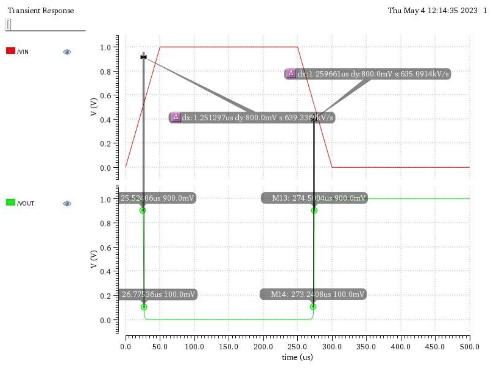

# CMOS Inverter

- **DVD project:** CMOS Inverter with balanced rise and fall time
- **Full document:** [PES2UG21EC003_DVD_RPT.pdf](PES2UG21EC003_DVD_RPT.pdf)

- CMOS Inverter circuit

- CMOS Test Circuit

- ADE L Settings

- Output Graph

